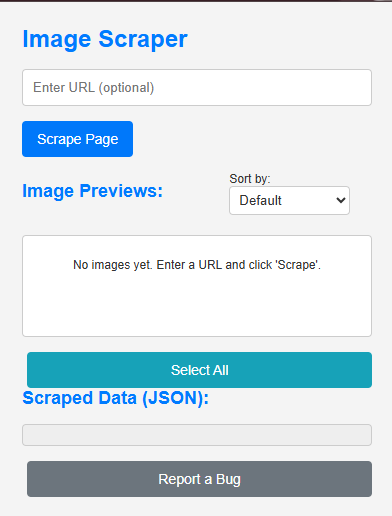

# Advanced Media Scraper Chrome Extension

This powerful Chrome extension is designed to scrape images and videos from web pages with a modern, intuitive user interface. It offers flexible scraping options, supports various download formats, and includes a light/dark theme for a personalized experience.

## ✨ Features

* **Comprehensive Media Scraping:** Efficiently detects and lists both image and video URLs present on the active tab or a specified URL.
* **Flexible Scrape Modes:** Choose to scrape "Images Only," "Videos Only," or "Both" media types.
* **Modern User Interface:** Enjoy a clean, responsive, and visually appealing design with smooth transitions and animations.
* **Theme Customization:** Seamlessly switch between **Light Mode** and **Dark Mode** to suit your preference and environment.
* **Image Previews & Sorting:** View small thumbnails of scraped images and sort them by URL (ascending/descending) for better organization.
* **Versatile Download Options:**
    * **Images:** Download selected images individually or as a single `.zip` archive for bulk downloads.
    * **Videos:** Download selected video links directly via Chrome's download manager.
* **Structured Data Export:** Export all scraped data (including page title, URL, timestamp, image URLs, and video URLs) into a readable `.json` file.
* **Targeted URL Input:** Ability to specify any URL for scraping, or simply use the current active browser tab.
* **Specialized Scrapers:** Includes dedicated scraping logic for specific platforms (e.g., Facebook, Jumia) alongside a generic scraper.

## 🚀 Installation

To install this extension in your Chrome browser:

1.  **Download the project:** Clone this repository or download the ZIP file and extract it to a local folder.
2.  **Install Dependencies:** Open your terminal or command prompt in the project's root directory and run `npm install` to install all necessary packages (like JSZip, Webpack).
3.  **Build the Project:** After installing dependencies, run `npm run build` (or `webpack`) to compile and bundle the source files into the `dist/` directory. This step is crucial for the extension to work correctly.
4.  **Open Chrome Extensions:** Navigate to `chrome://extensions` in your browser.
5.  **Enable Developer Mode:** Toggle on the "Developer mode" switch, usually found in the top-right corner.
6.  **Load Unpacked:** Click on the "Load unpacked" button.
7.  **Select Distribution Folder:** Browse to the `dist/` directory within your extracted project folder and click "Select Folder".

The extension should now appear in your list of extensions, and its icon will be visible in your browser toolbar.

## 🖥️ Usage

1.  **Activate the Extension:** Click on the extension's icon in your Chrome toolbar. This will open the popup window with the modern UI.
2.  **Toggle Theme:** Use the theme toggle switch in the header to switch between light and dark mode. Your preference will be saved.
3.  **Specify URL (Optional):**
    * To scrape the content of your current active tab, leave the "Enter URL to scrape" field empty.
    * To scrape content from a different webpage, paste its URL into the input field.
4.  **Choose Scrape Type:** Select your preferred scraping target using the radio buttons: "Images & Videos," "Images Only," or "Videos Only."
5.  **Initiate Scraping:** Click the "Scrape Page" button. A smooth loading overlay will indicate the scraping progress.
6.  **Review Scraped Media:**
    * **Images:** Browse image previews, sort them using the dropdown, and use the checkboxes to select specific images.
    * **Videos:** View the list of detected video URLs and use checkboxes to select them.
7.  **Download Your Media:**
    * **Images:** Select desired images. If one is selected, click "Download Image." If multiple are selected, click "Download Images (ZIP)" to get them in a compressed archive.
    * **Videos:** Select desired videos and click "Download Selected Videos" to initiate individual downloads via Chrome's download manager.
8.  **Export Data:** Click the "Download JSON" button to save all scraped data (including page title, URL, and lists of images/videos) into a `.json` file for further analysis.
9.  **Report a Bug:** Use the "Report a Bug" button in the footer to quickly compose an email if you encounter any issues.

## 📂 File Structure

The project follows a structured approach, utilizing Webpack for bundling and organizing source files, and includes specialized scraper modules.

.
├── .github/                       # GitHub-specific configurations (e.g., CI/CD workflows, issue templates)
├── .gitignore                     # Specifies files and directories to be ignored by Git
├── .eslintrc.js                   # ESLint configuration for maintaining code quality
├── _config.yml                    # Configuration file (possibly for documentation or a static site)
├── background.js                  # Source for the Chrome Service Worker (background script)
├── bower.json                     # Bower package manager configuration
├── CHANGES                        # Project changelog
├── component                      # Component-related configuration
├── content/                       # Source directory for content scripts
│   ├── scrapers/                  # Contains specialized scraping logic for different websites
│   │   ├── facebookScraper.js     # Logic for scraping Facebook content
│   │   ├── genericScraper.js      # General-purpose scraping logic
│   │   └── jumiaScraper.js        # Logic for scraping Jumia content
│   └── content.js                 # Main content script injected into web pages
├── data/                          # Directory for data files
│   └── default_rules.json         # Default scraping rules or configurations
├── dist/                          # Output directory for Webpack-bundled files (this folder is loaded into Chrome)
│   ├── background.bundle.js       # Bundled and optimized background script
│   ├── background.bundle.js.LICENSE.txt # License info for the background bundle
│   ├── content.bundle.js          # Bundled and optimized content script
│   ├── options.bundle.js          # Bundled and optimized options page script
│   ├── popup.bundle.js            # Bundled and optimized popup script
│   ├── manifest.json              # Copied manifest file
│   ├── options.html               # Copied HTML for the options page
│   ├── popup.html                 # Copied HTML for the popup interface
│   └── style.css                  # Copied global/popup stylesheet
├── docs/                          # Project documentation files
├── documentation/                 # Additional documentation resources
├── Gruntfile.js                   # Grunt.js build automation configuration
├── icons/                         # Directory for all extension icons (16x16, 48x48, 128x128)
├── index.d.ts                     # TypeScript declaration file
├── index.html                     # Main HTML file (could be for a dev server or larger project)
├── index.js                       # Main JavaScript file (could be for a dev server or larger project)
├── lib/                           # Utility or shared library scripts
├── LICENSE                        # Project's license file
├── node_modules/                  # Directory containing installed Node.js modules (dependencies)
├── options.html                   # Source HTML for the extension's options page
├── options.js                     # Source JavaScript for the options page logic
├── package-lock.json              # Records exact dependency versions for consistent builds
├── package.json                   # Project metadata, scripts, and npm dependencies
├── popup.html                     # Source HTML for the extension's main popup interface
├── popup.js                       # Source JavaScript for the popup logic and UI interactions
├── README                         # This README file
├── sponsors                       # Information about project sponsors
├── style.css                      # Source global or shared stylesheet
├── test/                          # Directory for project tests
├── tsconfig.json                  # TypeScript configuration file
├── vendor/                        # Third-party vendor assets or libraries
└── webpack.config.js              # Webpack configuration file for bundling assets

## 📸 Screenshots

*(Replace this section with actual screenshots of your **new**, modern extension UI, showcasing both light/dark themes and the image/video scraping results.)*

*A sample screenshot of the extension popup in Light Mode, showing scraped images and videos.*

*A sample screenshot of the extension popup in Dark Mode, demonstrating the theme change.*

## 🤝 Contributing

We welcome contributions! If you have suggestions for new features, improvements, or discover any bugs, please feel free to:

1.  Fork the repository.
2.  Create a new branch (`git checkout -b feature/YourFeature` or `fix/YourBug`).
3.  Make your changes and ensure tests (if applicable) pass.
4.  Commit your changes (`git commit -m 'Add Your Feature'`).
5.  Push to the branch (`git push origin feature/YourFeature`).
6.  Open a Pull Request.

## 📄 License

This project is licensed under the MIT License - see the `LICENSE` file for details.

## 🙏 Acknowledgements

* [JSZip](https://stuk.github.io/jszip/) for client-side ZIP file generation.
* [Webpack](https://webpack.js.org/) for efficient module bundling.
* [Font Awesome](https://fontawesome.com/) for icons.
* (Add any other significant libraries or resources you use)